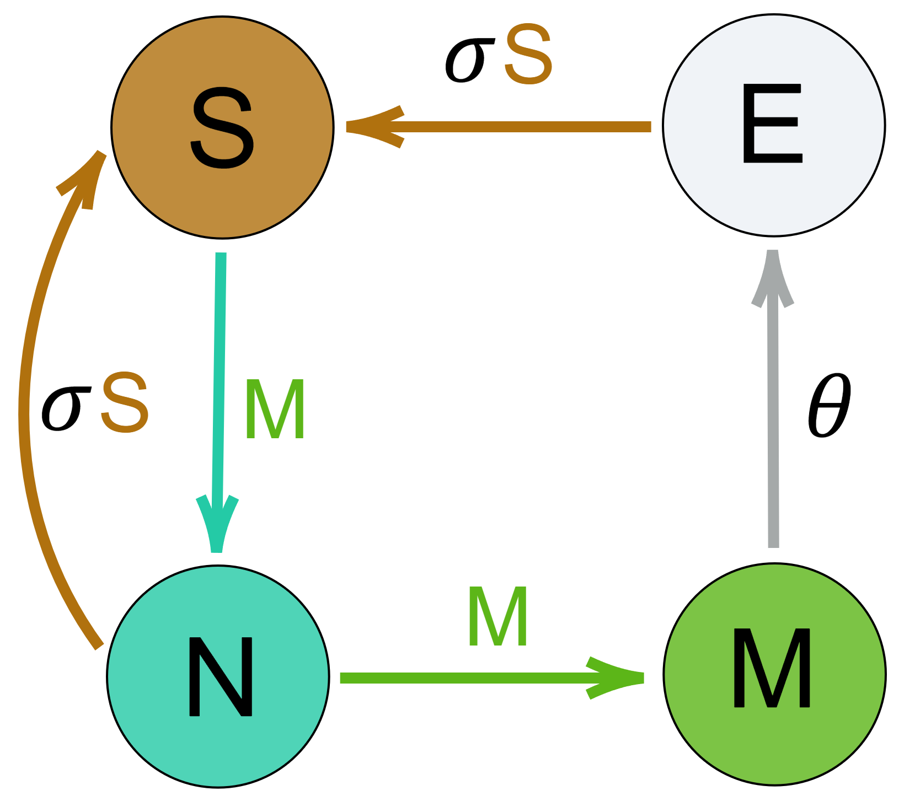
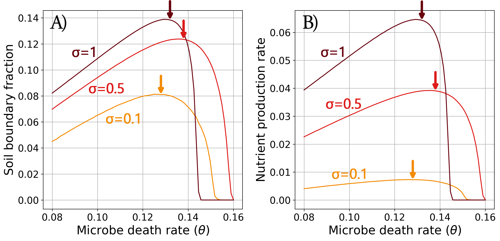
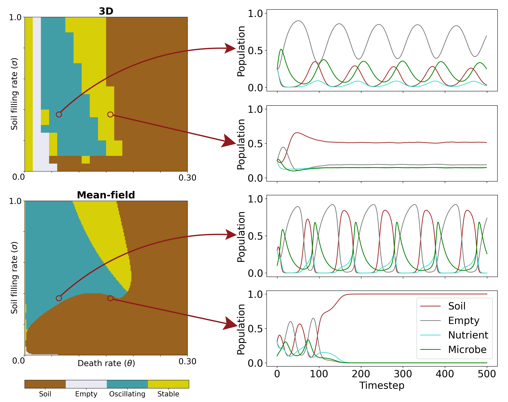
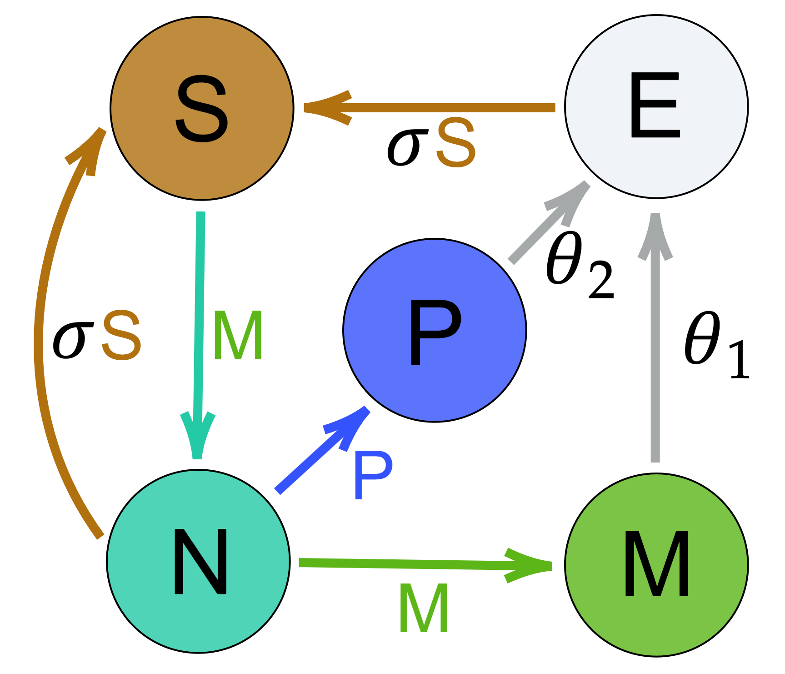
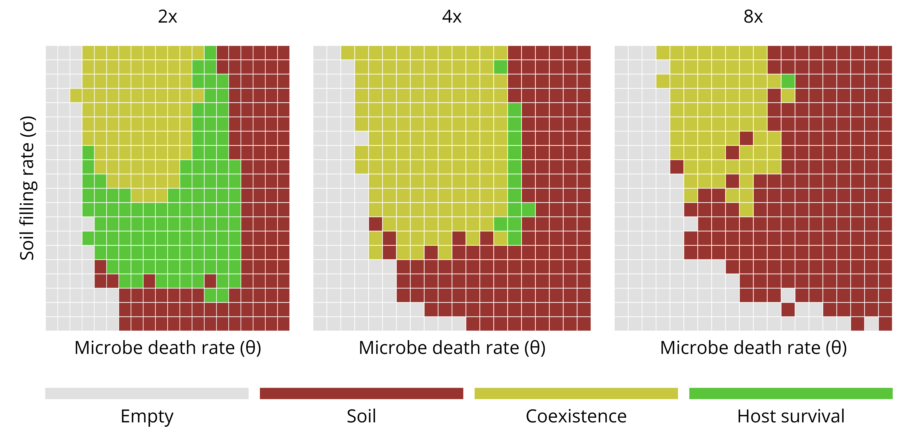

# Self-Organised Soil

$\\$
Riz Fernando Noronha

---

## Why soil?
$\\$

- Soil drives agriculture, and helps sustain the biosphere
 
- Ecosystem for organisms across the tree of life
 
- Extremely important for humanity

---

- Soil particle-sizes follow a power-law

- Typically explained through *fragmentation*: Soil $\approx$ fragmented rocks

- Fragmentation follows a power law, and can be used to explain soil

</img>
<a href="https://acsess.onlinelibrary.wiley.com/doi/abs/10.2136/sssaj1989.03615995005300040001x">Tyler and Wheatcraft, 1989</a>

---

- Soil has a lot of life!
 
- Modelling as a purely inorganic substance is not enough
 
- *'Biomaterial'*
 

<a href="https://www.pnas.org/doi/full/10.1073/pnas.2304663120">Anthony, Bender, & Heijden, 2023</a>

---

### Biological impact on soil structure

- **Soil porosity** appears to increase

- *Larger particles* (>2μm) of soil are observed

- Perhaps biologically induced **soil-aggregation**?

</img>

</img>

<a href="https://www.pnas.org/doi/full/10.1073/pnas.2304663120">Feeney et al 2006</a>

---

### Feedback Loop?

---

### Algorithm

</img>

- Microbes convert soil to nutrients
- Microbes use nutrients to reproduce
- Soil 'grows' from empty and nutrients
- Predator-prey with time-delay

---

### Cellular Automaton Model

$\\$

- Stochastic Sequential Algorithm

- Microbe create nutrients *in their vicinity*

- Microbes thus help each other survive

</img>

---

<iframe width="100%" height="100%" src="https://rizfn.github.io/Self-Organized-Soil/visualizations/defence/nutrient_lattice_density.html" style="border: 1px solid #ccc" frameborder=0>
</iframe>

---

### Survival in lattice vs Meanfield

---

### Soil particle sizes

Nearest neighbour connected components for clusters:
$\implies$ both are a cluster of size 36!

---

<iframe width="100%" height="100%" src="https://rizfn.github.io/Self-Organized-Soil/visualizations/defence/nutrient_lattice_density.html" style="border: 1px solid #ccc" frameborder=0>
</iframe>

---

### Cluster size distributions

---

## Nutrient Maximization

---

## Conclusion

---

### Acknowledgements

$\\$

</img>
Kunihiko Kaneko

</img>
Kim Sneppen

---

# Additional Slides

---

### Mean-Field Equations

$$
\definecolor{darkergrey}{rgb}{0.35, 0.35, 0.35}
\begin{align}
\frac{\mathrm{d}\textcolor{brown}{S}}{\mathrm{d}t} &= \sigma \textcolor{brown}{S} (\textcolor{darkergrey}{E} + \textcolor{teal}{N}) - \textcolor{green}{M} \textcolor{brown}{S} \\
\frac{\mathrm{d}\textcolor{darkergrey}{E}}{\mathrm{d}t} &= \theta \textcolor{green}{M} - \sigma \textcolor{brown}{S} \textcolor{darkergrey}{E} \\
\frac{\mathrm{d}\textcolor{teal}{N}}{\mathrm{d}t} &= \textcolor{green}{M} \textcolor{brown}{S} - \textcolor{green}{M} \textcolor{teal}{N} - \sigma \textcolor{brown}{S} \textcolor{teal}{N} \\
\frac{\mathrm{d}\textcolor{green}{M}}{\mathrm{d}t} &= \textcolor{green}{M} \textcolor{teal}{N} - \theta \textcolor{green}{M}
\end{align}
$$

---

<iframe width="100%" height="100%" src="https://rizfn.github.io/Self-Organized-Soil/visualizations/nutrient_meanfield_attractors.html" style="border: 1px solid #cccccc" frameborder=0>
</iframe>

---

<iframe width="100%" height="100%" src="https://rizfn.github.io/Self-Organized-Soil/visualizations/defence/nutrient_lattice_3D_density.html" style="border: 1px solid #ccc" frameborder=0>
</iframe>

---

### Survival in lattice vs Meanfield

---

Spatial structure **damps** oscillations

---

## Directed Percolation

</img>

- One 'preferred' direction (time)

- Each site 'spreads' into neighbouring sites

- Three critical exponents
  - $\rho^\text{stat} \sim (p-p_c)^\beta$
  - $\xi_\parallel \ \ \ \, \sim (p - p_c)^{-\nu_\parallel}$
  - $\xi_\perp \ \ \ \sim (p - p_c)^{-\nu_\perp}$

---

### Investigating Cluster Size Distributions

<iframe width="100%" height="100%" src="https://rizfn.github.io/Self-Organized-Soil/visualizations/defence/DP_2D_stl.html" style="max-width:100% border: 1px solid #ccc" frameborder=0>
</iframe>

- In the 2D supercritical region, we let the system stabilize at $\rho^\text{stat}$

- Take slice at *constant time*, and look at the 2D structure

- Similar to site percolation, but with short range correlations

---

### Critical Points

---

- Site percolation critical points

- Increasing $p$, first *empty clusters* follow a power law

- Next, *filled clusters* follow a power law

- Exponent appears to be $\approx 1.85$

---

### Dimensionality scaling

Critical points *swap positions* in 3D and beyond:

DP $\rightarrow$ Filled $\rightarrow$ Empty

 $~$ 

---

### Two Species: Parasite

$$\\$$

- Add a second species, a parasite
- Parasites **cannot create** nutrients
- Parasites live longer (die at rate $\theta_2 ,< \theta_1$) to compensate 

</img>

---

#### Mean-Field: Parasite Problem

$\\$

- Microbes don't care who creates the nutrient
- A slight advantage mean you dominate
- **Coexistence is impossible!**
  *Competitive exclusion*: Lower $\theta$ always wins

---

<iframe width="100%" height="100%" src="https://rizfn.github.io/Self-Organized-Soil/visualizations/defence/twospec_samenutrient_lattice_st_density.html" style="border: 1px solid #ccc" frameborder=0>
</iframe>

---

### Varying parasite strength

---

### Two Symbiotes

- Two species, two nutrients

- Eat the other's nutrient to survive

---

### Nutrient Correlation in other cases

$\\$

**Parasites:**

- Power law $=$ long range correlations $\sim$ Meanfield

- Meanfield is **bad**, so power law is avoided?

**3D:**

- Isotropic model, real soil is siginificantly anisotropic

---

<iframe width="100%" height="100%" src="https://rizfn.github.io/Self-Organized-Soil/visualizations/twospec_samenutrient_lattice.html" style="border: 1px solid #ccc" frameborder=0>
</iframe>

---

### Multiple Nutrients
$\\$

- Have microbes eat all other nutrients, besides their own
  - Microbes simply oscillate in phase
  - Similar to single-species model

- Have microbes eat nutrients in a cycle
  - 1 > 2 > 3 > 4 > 1, etc

---

<video src="images/feb29/4spec.mp4" style="max-width: 100%;" autoplay muted loop></video>

<video src="images/feb29/5spec.mp4" style="max-width: 100%;" autoplay muted loop></video>

---

Literature suggests **spiral waves**...

</img>

 <a href="https://pubmed.ncbi.nlm.nih.gov/14604183/">Takeuchi and Hogweg, 2012</a> 

---

#### Why no Spirals?

- Assume we have a magical wave source.

- Waves ejected in the right order

- Soil needed for nutrient generation, and so waves **cannot propagate**!

</img>
</img>

---

##### After removing soil

<video src="images/feb29/nosoil_4spec.mp4" style="max-width: 100%;" autoplay muted loop></video>

<video src="images/feb29/nosoil_5spec.mp4" style="max-width: 100%;" autoplay muted loop></video>

---

### Spatial confinement

$\\$

- Assuming you're surrounded by soil, how do you propagate into it?

- *All species* must be present on the expansion boundary

- Expansion is hard!

---

<video src="images/feb29/4spec_boundary.mp4" style="max-width: 100%;" autoplay muted loop></video>

<video src="images/feb29/5spec_boundary.mp4" style="max-width: 100%;" autoplay muted loop></video>

---

### Powerlaw math
$\\$

$$
\begin{align*}
P_1(r)\; dr &= P_2(V) \; dV \\
P_1(r) &\sim P_2(V) \cdot r^2
\end{align*}
$$

Given that $P_2(V) \sim V^{-\tau}$ and $V\sim r^3$:

$$
\begin{align*}
P_1(r) &\sim V^{-\tau} \cdot r^2 \\
  &\sim r^{-3\tau} \cdot r^2 \\
  &\sim r^{2 - 3\tau}
\end{align*}
$$

$$
\begin{align*}
r^D &\sim \int P_1(r) dr \\
  &\sim \int r^{2-3\tau} dr \\
  &\sim r^{3-3\tau}
\end{align*}
$$

For $\tau\approx2.25$, $D\approx3.75$

