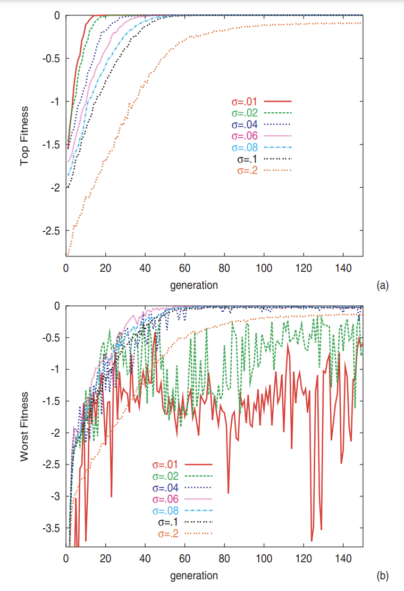
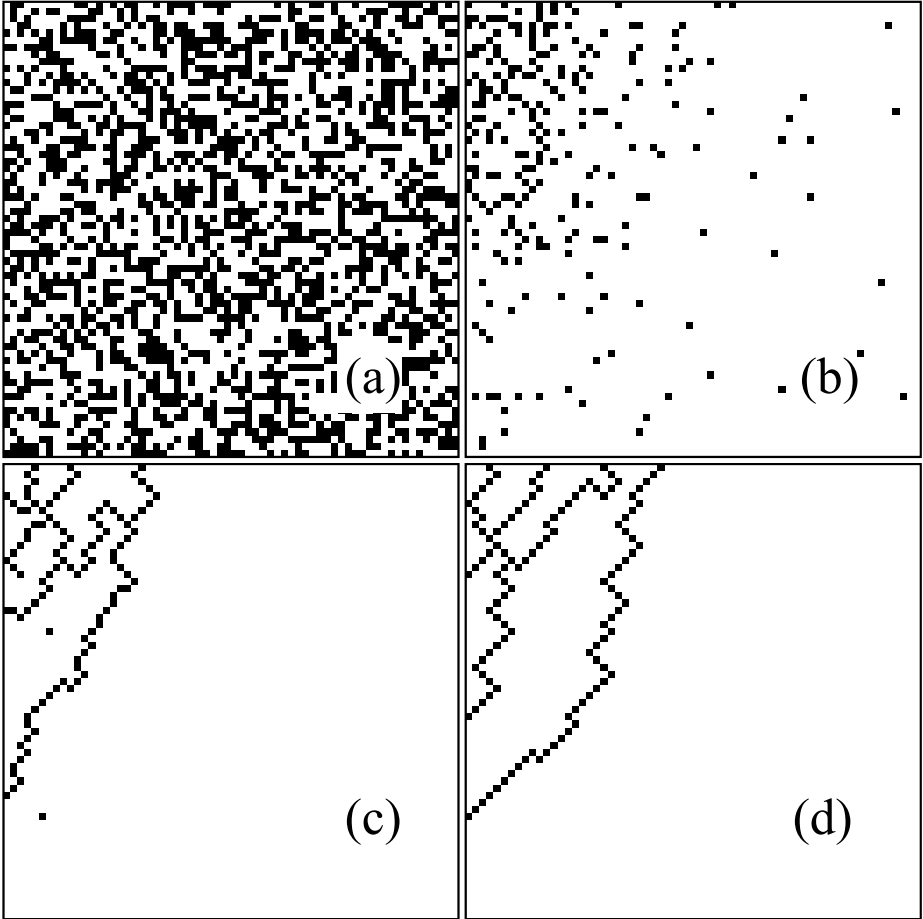
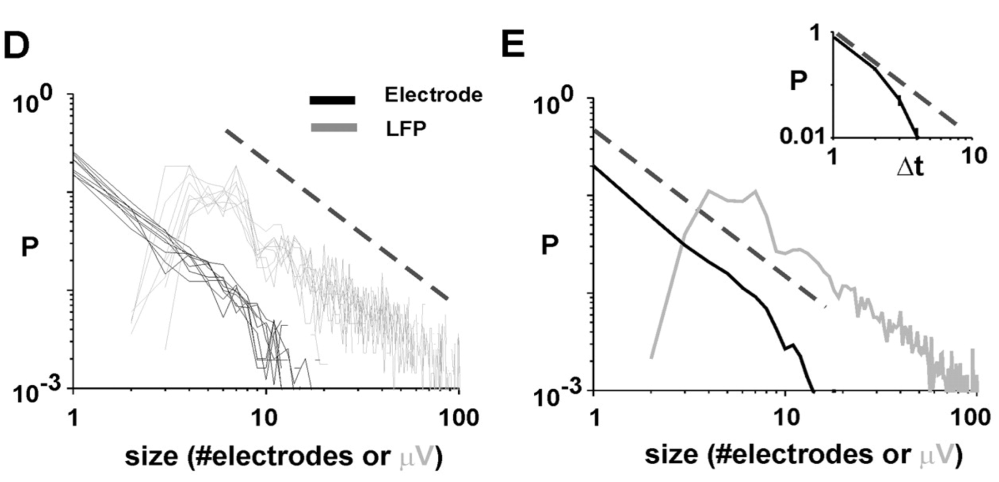
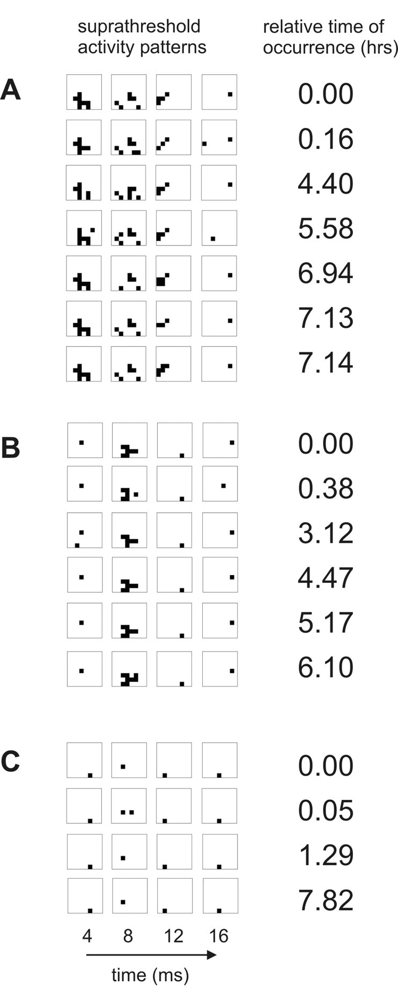
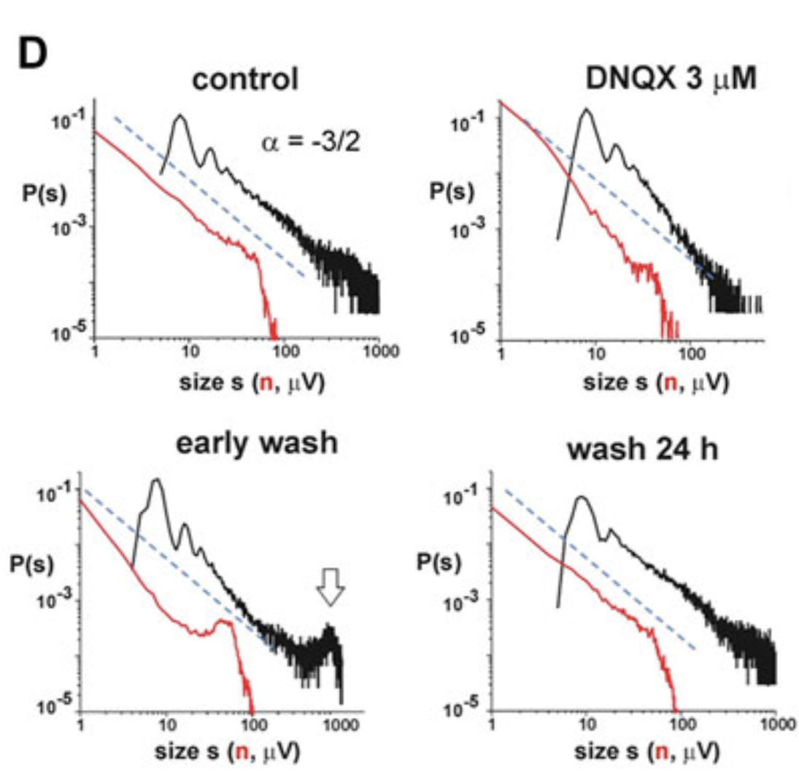
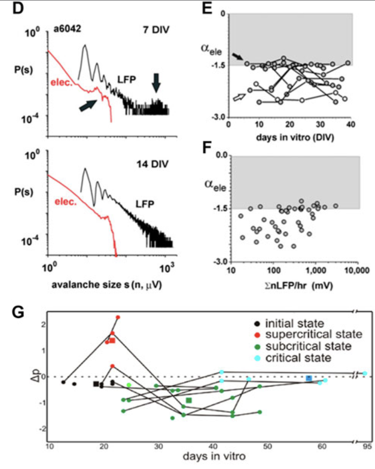

## PhD Research Plan

 

**Riz Fernando Noronha**
**Niels Bohr Institute**

---

### Methodology

 

- Simulations + Analytical work
   
  - Analytical solutions where possible
  - Simulations to explore complex scenarios

---

### Guiding Principles

 

1. **Simple** models
   - Strip phenemena down!
   - Few parameters
 
1. **Generalizable** models
   - Behaviour across different length scales

---

### Project 1: Evolution

 

- Robustness and Plasticity
  - very _generic_ concepts, true across length scales

 

**Goal:** To make a _simple_ model with this behaviour

---

**Genetic Algorithms:**

 

- Built similar to GRNs

- Take top performers and mutate

- Robustness emerges (depending on noise)

<a href='https://journals.plos.org/plosone/article?id=10.1371/journal.pone.0000434'>K. Kaneko (2007)</a>

---

**Highly Optimized Tolerance (HOT)**

<a href='https://journals.aps.org/pre/abstract/10.1103/PhysRevE.60.1412'>Carlson, J. M., & Doyle, J. (1999)</a>

   

- Cellular automata

- Suggests optimal behavior is critical

- Robustness? 

---

### Project 2: SOC in Neural Avalanches

 

**Goal:** Explain the SOC behaviour

 

Periods of inactivity followed by multiple neuron activations

</img>
<a href='https://www.jneurosci.org/content/23/35/11167.short'>Beggs, J. M., & Plenz, D. (2003)</a>

---

- **Avalanche models** suggested
  - data has _repeating patterns_
    <a href='https://pubmed.ncbi.nlm.nih.gov/15175392/'>Beggs, J. M., & Plenz, D. (2004)</a>
 
- "Percolation" like **network model** instead
  - needs to be tuned to criticality
  
---

"Doping" the cortex
</img> 
 <a href='https://link.springer.com/article/10.1140/epjst/e2012-01575-5'>Plenz, D. (2012)</a> 

Development over time
</img> 
 <a href='https://www.frontiersin.org/articles/10.3389/fphy.2021.639389/full'>Plenz, D., Ribeiro, T. L., Miller, S. R., Kells, P. A., Vakili, A., & Capek, E. L. (2021)</a> 

