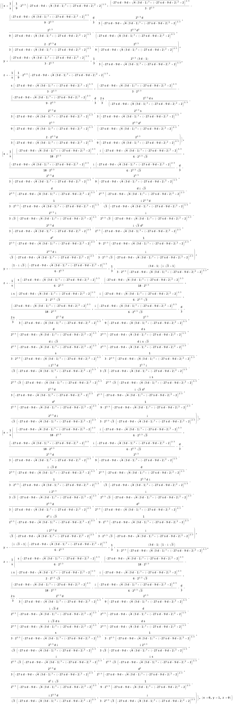

<!-- <style>
  :root {
    --color-background: #ddd;
    --color-foreground: #345;
  }
</style> -->


# Self-Organised Soil

<br>
Riz Fernando Noronha

Supervised by Kim Sneppen and Kunihiko Kaneko


---

- Inter-soil spacings appear to follow a power law

- In particular, the exponent appears to depend on the *biodiversity* of the soil

- Something causes the soil to *self-organize* into this critical state

---

#### Parameters

- $d$: Death rate of worms
- $r$: Reproductive rate of worms
- $s$: Soil filling rate

<br>
<br>

> *One is a great number!*

---

#### Algorithm

```java
choose random_site
if (random_site == empty):
  fill with probability s
else if (random_site == worm):
  die with probability d
  if (not dead):
    move to neighbour_site
    if (neighbour_site == soil):
      choose target_site
      if (target_site == empty):
        reproduce with probability r
```

---

<iframe width="auto" height="1000px" src="https://rizfn.github.io/Masters-Thesis/visualizations/rasterscan.html">
</iframe>

---

### Mean-Field equations
<br>

$$
\begin{align}
    \frac{\mathrm{d}E(t)}{\mathrm{d}t} &= d\cdot B + B\cdot S - r\cdot B\cdot S\cdot E - s\cdot E \\
    \frac{\mathrm{d}S(t)}{\mathrm{d}t} &= s\cdot E - B\cdot S \\
    \frac{\mathrm{d}B(t)}{\mathrm{d}t} &= r\cdot B\cdot S\cdot E - d\cdot B
\end{align}
$$

---

<iframe width="auto" height="1000px" src="https://rizfn.github.io/Masters-Thesis/visualizations/rasterscan_meanfield.html">
</iframe>

---



#### Four fixed points

1. Always negative
2. Complex
3. Complex
4. Pure soil

---

#### Saddle node bifurcation

<iframe src="https://www.desmos.com/calculator/rwa4klpx87?embed" width="auto" height="500" style="border: 1px solid #ccc" frameborder=0></iframe>

