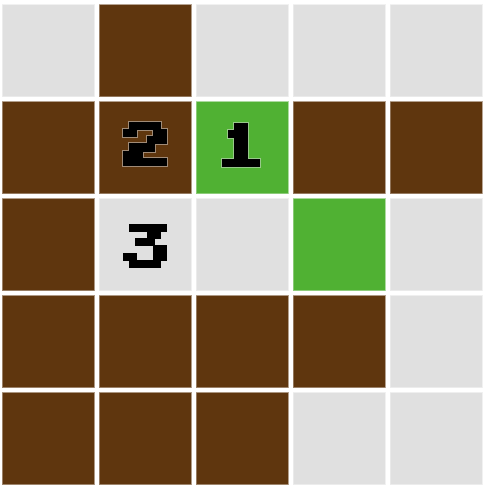
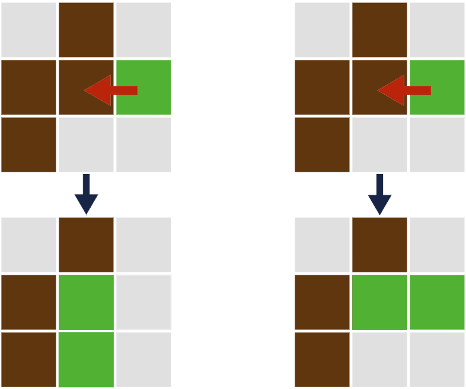
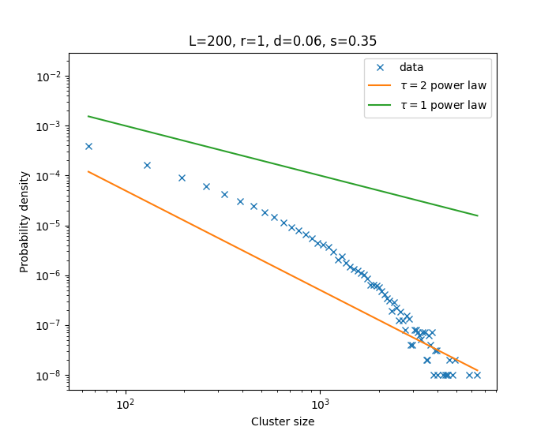
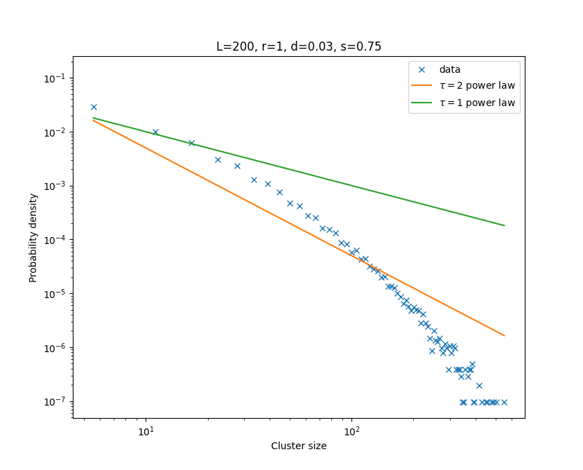

<!-- <style>
  :root {
    --color-background: #ddd;
    --color-foreground: #345;
  }
</style> -->


# Self-Organised Soil

<br>
Riz Fernando Noronha

Supervised by Kim Sneppen and Kunihiko Kaneko


---

<div class='columns'>


- Soil has a fractal struture

- There is a correlation between the fractal dimension and the biodiversity of the soil

- *Hypothesis:* Biology contributes to the fractal structure

</img>
[Image source](https://www.nature.com/articles/s41598-020-77676-w)

</div>

---

#### Parameters

- $\theta$: Death rate of worms
- $\rho$: Reproductive rate of worms
- $\sigma$: Soil filling rate

<br>
<br>

> *One is a great number!*

---

#### Algorithm

<div class="columns">

```java
choose random_site

if (random_site == empty):
  choose neighbour_site
  if (neighbour_site == soil):
    fill with probability σ

else if (random_site == worm):
  die with probability θ

  if (not dead):
    move to neighbour_site

    if (neighbour_site == soil):
      choose target_site
      if (target_site == empty):
        reproduce with probability ρ
```



</div>

---

<iframe width="auto" height="1000px" src="https://rizfn.github.io/Self-Organized-Soil/visualizations/soil_neighbour_rasterscan.html"style="border: 1px solid #ccc" frameborder=0>
</iframe>

---

### Mean-Field equations
<br>

$$
\begin{align}
    \frac{\mathrm{d}E(t)}{\mathrm{d}t} &= \theta\cdot W + W\cdot S - \rho\cdot W\cdot S\cdot E - \sigma\cdot S\cdot E \\
    \frac{\mathrm{d}S(t)}{\mathrm{d}t} &= \sigma\cdot S\cdot E - W\cdot S \\
    \frac{\mathrm{d}W(t)}{\mathrm{d}t} &= \rho\cdot W\cdot S\cdot E - \theta\cdot W
\end{align}
$$

---

<iframe width="auto" height="1000px" src="https://rizfn.github.io/Self-Organized-Soil/visualizations/soil_neighbour_rasterscan_meanfield.html"style="border: 1px solid #ccc" frameborder=0>
</iframe>

---

### Bifurcation analysis
<br>

$$
\begin{align}
    \frac{\mathrm{d}E(t)}{\mathrm{d}t} &= \theta\cdot W + W\cdot S - \rho\cdot W\cdot S\cdot E - \sigma\cdot S\cdot E &&=0 \\
    \frac{\mathrm{d}S(t)}{\mathrm{d}t} &= \sigma\cdot S\cdot E - W\cdot S &&=0 \\
    \frac{\mathrm{d}W(t)}{\mathrm{d}t} &= \rho\cdot W\cdot S\cdot E - \theta\cdot W &&=0
\end{align}
$$
<br>

$$W+E+S=1$$


---


#### Four fixed points

1. Always negative
2. Complex
3. Complex conjugate
4. Pure soil

---

#### Saddle node bifurcation

<iframe src="https://www.desmos.com/calculator/rwa4klpx87?embed" width="auto" height="500" style="border: 1px solid #ccc" frameborder=0></iframe>

---

### Predator-Prey model

<div class="columns">

$$
\begin{align*}
\frac{\mathrm{d}E}{\mathrm{d}t} &= \theta \cdot W - \sigma \cdot E \cdot S \\ \\
\frac{\mathrm{d}S}{\mathrm{d}t} &= \sigma \cdot E \cdot S - \rho \cdot W \cdot S \\ \\
\frac{\mathrm{d}W}{\mathrm{d}t} &= \rho \cdot W \cdot S - \theta \cdot W
\end{align*}
$$

<div>
<pre> Old model     Predator-Prey</pre>
</img>
</div>

</div>

---

<iframe width="auto" height="1000px" src="https://rizfn.github.io/Self-Organized-Soil/visualizations/soil_neighbour_rasterscan_meanfield.html"style="border: 1px solid #ccc" frameborder=0>
</iframe>

---

<div class="columns">

<div> 
Predator prey

<iframe src="https://www.desmos.com/calculator/4awpbqdqi4?embed" width="500" height="500" style="border: 1px solid #ccc" frameborder=0></iframe>
</div>

<div>
Previous model
<iframe src="https://www.desmos.com/calculator/prdbzv3s5n?embed" width="500" height="500" style="border: 1px solid #ccc" frameborder=0></iframe>
</div>

</div>

---

#### Critical behaviour(?)


Look at the `cluster size distribution` of the soil

<div class="columns">

<div>
On the boundary
</img>
</div>

<div>
Inside the region
</img>
</div>

</div>

---

### Two Species
<br>

- `red` leave behind `lightred` when moving and dying
<br>
- `blue` leave behind `lightblue`
<br>
- `red` reproduce in `lightblue`, `blue` reproduce in `lightred`

---

<iframe width="auto" height="1000px" src="https://rizfn.github.io/Self-Organized-Soil/visualizations/twospec_soilneighbour_rasterscan.html"style="border: 1px solid #ccc" frameborder=0>
</iframe>

---

<iframe width="auto" height="1000px" src="https://rizfn.github.io/Self-Organized-Soil/visualizations/twospec_soilneighbour_meanfield.html"style="border: 1px solid #ccc" frameborder=0>
</iframe>

---

### Coupled Map Lattice

<br>

- "Continuous" Cellular Automata
- Two values per site:
  - Soil densities; $d_{i,j}$
  - Worm counts; $w_{i,j}$
- Parallel update every timestep:
  - Smoothen
  - Worm birth/death
  - Worm action on soil

---

#### Algorithm

<br>
<br>

<div class="columns">

$$
\begin{align*}
\dot{D} &= s \cdot\nabla^2 D \\ \\
\dot{W} &= b \cdot \left( f(D) - W \right) \\ \\
\dot{D} &= i \cdot \left( - \frac14 \nabla^2 \left(DW\right) \right)
\end{align*}
$$


- Soil diffuses ~ $\sigma$ <br> <br>
- Worms update ~ $\rho, \theta$ <br><br>
- Worms push soil
</div>


---

<iframe width="auto" height="1000px" src="https://rizfn.github.io/Self-Organized-Soil/visualizations/CML_conserved_soil.html"style="border: 1px solid #ccc" frameborder=0> </iframe>

