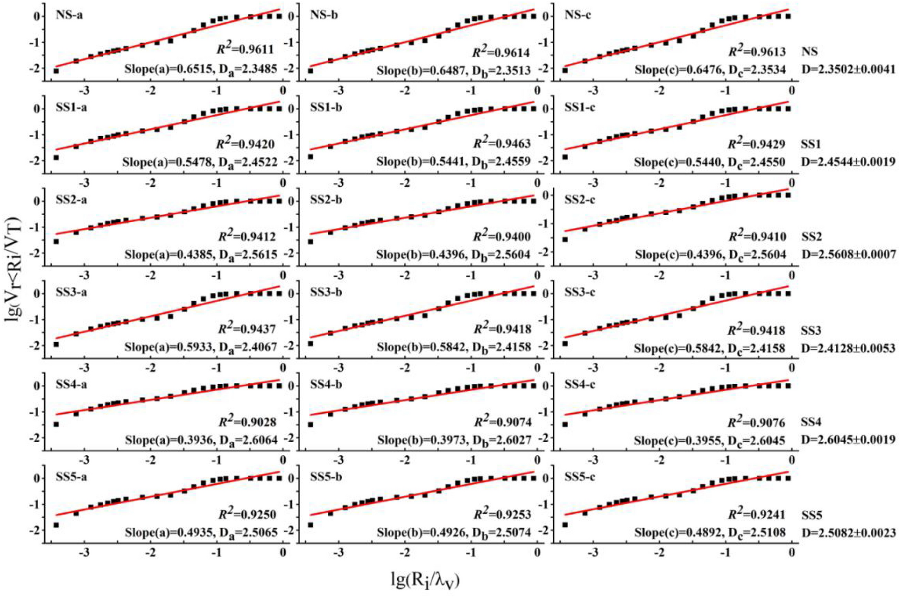

# Math with power laws

Calculating the fractal dimension of soil from the cluster size

---

---

- Calculating $V_{v_i \lt V^\prime}$: cumlative volume.

- Only interested in scaling, thus
  $V \approx r^3$ 

---

## From the simulation

Cluster size dist ~ volume distribution

$$ P(V) = V^{\alpha} $$

Volume contributed by a particle is then $V \cdot P(V)$

$$
\begin{align*}
V_{v_i \lt V^\prime} &\approx \int_0^{V^\prime} V \cdot P(V)\, dV \\
&\approx V^\prime{^{2+\alpha}} \\
&\approx R^\prime{^{6 + 3\alpha}}
\end{align*}
$$

---

#### A more convoluted way

Assuming we know $P(r)$, the probability of a soil particle having radius $r$:

$$
\begin{align*}
V_{v_i \lt V^\prime} &\approx \int_0^{R^\prime} r^3 P(r) \,dr \\
\end{align*}
$$

We don't know $P(r)$, only $P(V)$!

---

$$ V_{v_i \lt V^\prime} \approx \int_0^{R^\prime} r^3 P(r)\, dr $$

$$ P_1(r) \, dr = P_2(V) \, dV $$
$$ P_1(r) = P_2(r^3) \cdot r^2 $$

$$
\begin{align*}
V_{v_i \lt V^\prime} &\approx \int_0^{R^\prime} r^3 r^2 P(r^3) \,dr \\
&\approx \int_0^{R^\prime} r^5 r^{3\alpha} \,dr  \\
&\approx R^\prime{^{6 + 3\alpha}}
\end{align*}
$$

---

## The final result:

If $P(V) = V^\alpha$,

The function on the graph is
$V_{v_i \lt V^\prime} = R^\prime{^{6 + 3\alpha}}$

The slope is 3-$D$, and so the dimension is:
$D=3\alpha-3$

---

- $P(V) = V^\alpha$, then $V_{v_i \lt V^\prime} = R^\prime{^{6 + 3\alpha}}$
  - $\implies D=3\alpha-3$
- Fragmentation $\alpha\approx 1.63$, meteors $1.8$.
  - $D \approx 1.89, 2.4$
- Our simulations suggest $\alpha\sim2 \implies D\sim 3$
- Real data:
  - [Plantations in China: 2.59-2.70](https://www.nature.com/articles/s41598-018-25543-0)
  - [Plain in China: 2.35 - 2.60](https://www.nature.com/articles/s41598-020-77676-w)
  - [SRM (Soil Rock Mixture) in China: 2.23-2.90](https://www.mdpi.com/2504-3110/6/2/120)
  - [Alluvial fans in China: 2.64-2.78](https://journals.plos.org/plosone/article?id=10.1371/journal.pone.0173555)
- Allegedly, $N(r_i > R) \approx R^{-D}$. Need to verify

